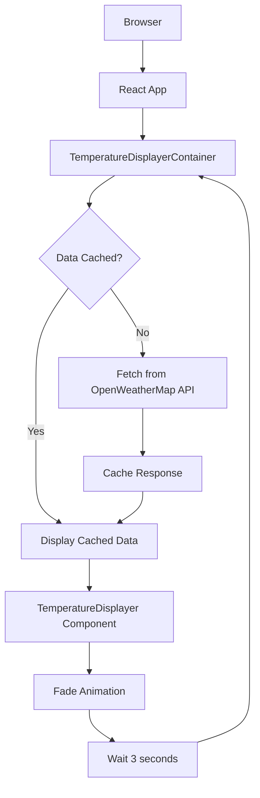
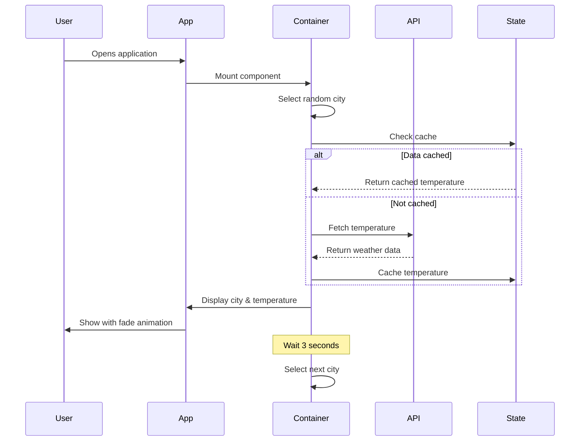

# Temperature City Displayer

A React.js web application that displays real-time temperature data from cities around the world using the OpenWeatherMap API. The application cycles through 80+ cities every 3 seconds with smooth fade animations.

Built in November 2018. This React application demonstrates API integration, state management, caching strategies, and dynamic UI updates.

## Features

- 🌍 Displays temperatures from 80+ cities worldwide
- 🔄 Automatic cycling through cities every 3 seconds
- 🎨 Smooth fade-in/fade-out animations
- 💾 Caches API responses to minimize requests
- 🌡️ Converts temperatures from Kelvin to Celsius
- 🎲 Random city selection (avoids consecutive repeats)
- 📱 Responsive design for all devices
- ⚡ Fast and lightweight

## Architecture



## Data Flow



## Getting Started

### Prerequisites

- Node.js (v8 or higher)
- npm or yarn
- OpenWeatherMap API key (included for demo)

### Installation

1. Clone the repository:
```bash
git clone https://github.com/orassayag/temperature-city-displayer.git
cd temperature-city-displayer
```

2. Install dependencies:
```bash
npm install
```

3. Start the development server:
```bash
npm start
```

4. Open [http://localhost:3000](http://localhost:3000) in your browser

### Configuration

Edit the settings in `src/settings/`:
- `settings.development.json`: Development environment configuration
- `settings.production.json`: Production environment configuration

**API Configuration:**
```json
{
  "api_base_url": "http://api.openweathermap.org/data/2.5/weather?q=#city#&appid=YOUR_API_KEY"
}
```

Replace `YOUR_API_KEY` with your OpenWeatherMap API key. Get one at [https://home.openweathermap.org/api_keys](https://home.openweathermap.org/api_keys)

## Available Scripts

### Start Development Server
Runs the app in development mode with hot-reloading:
```bash
npm start
```

### Build for Production
Creates an optimized production build:
```bash
npm run build
```

### Run Tests
Launches the test runner:
```bash
npm test
```

## Project Structure

```
temperature-city-displayer/
├── public/                          # Static files
│   ├── index.html                  # HTML template
│   └── manifest.json               # PWA manifest
├── src/
│   ├── api/                        # API integration layer
│   │   └── routes/
│   │       └── temperatures.js     # OpenWeatherMap API calls
│   ├── components/                 # Presentational components
│   │   └── Temperature/
│   │       ├── TemperatureDisplayer/
│   │       │   ├── TemperatureDisplayer.jsx
│   │       │   └── TemperatureDisplayer.less
│   │       └── index.js
│   ├── containers/                 # Container components with logic
│   │   ├── App/
│   │   │   └── App.jsx            # Main application container
│   │   └── TemperatureDisplayerContainer/
│   │       └── TemperatureDisplayerContainer.jsx
│   ├── hoc/                        # Higher-order components
│   │   └── Auxiliary/
│   │       └── Auxiliary.jsx
│   ├── settings/                   # Environment configuration
│   │   ├── settings.js            # Settings loader
│   │   ├── settings.development.json
│   │   └── settings.production.json
│   ├── utils/                      # Utility functions
│   │   ├── textUtils.js           # Text and city utilities
│   │   └── coreUtils.js           # Core utility functions
│   ├── index.jsx                   # Application entry point
│   ├── index.less                  # Global styles
│   └── registerServiceWorker.js    # PWA service worker
└── package.json
```

## Technologies Used

- **React.js** - Frontend framework
- **React Router** - Client-side routing
- **Axios** - HTTP client for API requests
- **LESS** - CSS preprocessor
- **PropTypes** - Runtime type checking
- **Webpack** - Module bundler
- **Babel** - JavaScript compiler
- **ESLint** - Code linting

## How It Works

### City Selection Algorithm
1. Maintains a list of 80+ cities in state
2. Randomly selects a city different from the previous one
3. Ensures variety and prevents consecutive repeats

### Caching Strategy
- First request: Fetches from API and stores in state
- Subsequent requests: Uses cached data
- Reduces API calls and improves performance

### Temperature Conversion
```javascript
Celsius = Kelvin - 273.15
```

### Animation Timing
- Display duration: 3 seconds per city
- Fade-in duration: Controlled via CSS transitions
- Fade-out duration: Controlled via CSS transitions

## Browser Support

- Chrome (latest)
- Firefox (latest)
- Safari (latest)
- Edge (latest)
- Mobile browsers

## API Rate Limits

OpenWeatherMap free tier limits:
- 60 calls per minute
- 1,000,000 calls per month

The caching strategy helps stay within these limits.

## Contributing

Contributions to this project are [released](https://help.github.com/articles/github-terms-of-service/#6-contributions-under-repository-license) to the public under the [project's open source license](LICENSE).

Everyone is welcome to contribute. Contributing doesn't just mean submitting pull requests—there are many different ways to get involved, including answering questions and reporting issues.

See [CONTRIBUTING.md](CONTRIBUTING.md) for detailed guidelines.

## Deployment

### Build
```bash
npm run build
```

### Deploy to Static Hosting
The `build` folder can be deployed to:
- GitHub Pages
- Netlify
- Vercel
- Any static hosting service

### Deployment Checklist
- [ ] Update API key in production settings
- [ ] Test in production environment
- [ ] Verify CORS configuration
- [ ] Check API rate limits
- [ ] Monitor error logs

## Future Enhancements

Potential improvements:
- Add city search functionality
- Display additional weather data (humidity, wind speed)
- User preferences for city list
- Dark mode support
- Weather icons
- Multi-language support
- Historical temperature data
- Favorites system

## Troubleshooting

### Common Issues

**API Errors:**
- Verify API key is valid
- Check city names match OpenWeatherMap format
- Review rate limits

**Build Errors:**
- Clear cache: `rm -rf node_modules && npm install`
- Update dependencies: `npm update`

**Display Issues:**
- Check browser console for errors
- Verify component PropTypes
- Test in different browsers

## Author

* **Or Assayag** - *Initial work* - [orassayag](https://github.com/orassayag)
* Or Assayag <orassayag@gmail.com>
* GitHub: https://github.com/orassayag
* StackOverflow: https://stackoverflow.com/users/4442606/or-assayag?tab=profile
* LinkedIn: https://linkedin.com/in/orassayag

## License

This application has an MIT license - see the [LICENSE](LICENSE) file for details.

## Acknowledgments

- OpenWeatherMap for providing the weather API
- React community for excellent documentation
- All contributors who help improve this project
